<h1 align="center">AWS Certifiel Develop Associate Study</h1>

<p align="center">
    
</p>
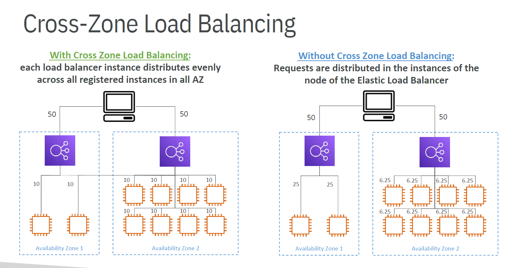

---
<h1>Regions AWS</h1>

### Levels of Regions & AZ (Availability Zone)

- Regions
- Availalability Zones
- Local Zones
- Point of Presence
- Network

---
<h1 align="center">IAM(Identity and Acess Management) & AWS CLI</h1>

## Users, Goups and Policies
É criado User e Goups para possemos atribuir policies a eles, fazendo com que tenham acesso aos serviços que necessitam ter, e não a tudo como um ADM. Os User e Goups pode receber um JSON document chamado POLICIES.

É uma Boa pratica criar um usuário ADM para fazer a administração da AWS, e resguardar a conta Root por segurança

## IAM Policies
Json document há uma estrutura como os seguintes campos: **Numero de versão** , **Id** para identificação da policie,e **Statement** contendo mais informações como: **Sid** sendo um ID de instrução, **effect** sendo o efeito da policie. **Principals** consiste em quais contas, usuário ou funções receberão essa policie. **Action** contendo uma lista de chamadas a API q serão setadas de acondo com o valor do campo **effect**. E resource contem uma lista de recursos que as ações serão aplicadas.

As policies é bom ser atribuídas a um grupo ou a um usuário. Também pode ser criado suas próprias Policies escrevendo um Json ou com interface visual.

Policies são reponsáveis por definir qual o nivel de acesso e a quais recursos da AWS.

## IAM MFA
É o sistema de proteção dos usuário e grupos contendo dois mecanismos de defesa. O primeiro é **Password Policy.** Nesse mecanismo pode ser configurado exigências na hora de cadastrar uma senha, como numero de caracteres, letras especiais etc. pode ser definido também um tempo de expiração das senhas para q sejam trocadas seguidamente. e também para não reutilizar senhas q já foram usadas.

O segundo mecanismo é o **MAF(Multi Factor Autentication).** O beneficio do MAF é que caso sua senha seja perdida/hackeada, não será comprometida pois para acessar, precisará dos números do MFA para fazer login.

**Dispositivos MAF da AWS:**
- **Virtual MFA** com Google Authenticator ou Authy;
- Universal 2nd Factor (U2F) Security Key. É um dispositivo Físico tipo USB;
- Hardware Key Fob MAF Device;
- AWS GovCloud;

## AWS Access Keys, CLI and SDK
Existem 3 jeitos de acessar a conta AWS;
- AWS Management Console (Password Policy + MFA);
- AWS CLI: Protegidas por chaves de acesso (Access Keys);
- AWS SDK: Protegidas por chave de acesso. Existe para Aplications, Mobile e IoT

Para gerar uma chave de acesso deve ser feito através da AWS Console

## Configurar AWS CLI

https://docs.aws.amazon.com/cli/latest/userguide/getting-started-version.html

Após fazer a instalação do CLI no seu computador, é necessário configurar o o acesso do CLI com as chaves de acesso do usuario(IAM > users > youruser > Security credentials).

``` AWS CLI
**C:\Users\Patrick>** aws configure
**AWS Access Key ID [None]:** 
**AWS Secret Access Key [None]:** 
**Default region name [None]:** sa-east-1
**Default output format [None]:** (enter)
```

Para testar o usuario adm configurado: 
``` AWS CLI
**C:\Users\Patrick>** aws iam list-users
```

## AWS Cloud Shell

Está disponível somente para algumas Regions

Todos os arquivos que forem criados em seu AWS Cloud Shell, mesmo após reiniciar o terminar ainda terá seus arquivos. É possível fazer Download e Upload de arquivos através do AWS Cloud Shell

## IAM Roles for AWS Services

É responsável por criar permissões aos serviços que o usuário esta usando, para que este serviço possa fazer outra interações com a AWS

## IAM Security Tools

IAM Credential Report(Acount Level) - Pode ser criado um relatório de credenciais do IAM;
_IAM > Credential Report > Download_

IAM Access Advisor(User Level) – Mostrará as permissões de serviço concedidas a um usuário
_IAM > User > YourUser > Access Advison_

---
<h1 align="center">EC2 Section</h1>

## EC2 (Elastic Copute Cloud)

É uma das ofertas mais populares da AWS e é usada em todos os lugares.

EC2 é uma maeira de fazer "ifraestructure as a service". Não é apenas um serviço, ele é composto por muitas outras coisas de alto nível.

- Pode criar VMs o EC2;
- Armazenar dados em virtual drivers(EBS);
- Pode distribuir carga entre maquinas (Elastic Load Balancer - ELB);
- Pode escalar serviços usando um grupo de escalonamento automático (ASG)

## Configuração EC2

- Pode haver Windows, Linux e Mac;
- CPU, Memória RAM, Storage Space(EBS e EFS ou EC2 storage);
- Qual network deseja, Placa de rede, IP público;
- Regras de Firewall (security group);
- Boosttrap Script (EC2 User Data)

**Bootstrap (EC2 Data User)**

Bootstrapping significa os comando laçados quando a VM estiver iniciando. Esse comandos rodarão apenas uma vez quando essa maquina for criada, e nunca mais será rodado. Com o EC2 Data User script você pode: instalar softwares, instalar updates, baixar arquivos da internet para que a sua instância d VM seja inicializada e já configurada como deseja. Quanto mais Scripts colocar, mais demorado será para criar sua instância. TODOS os EC2 data user são rodados como Root.

## EC2 hands on

EC2 > instances > launch an Instance

Sempre usar a **t2.micro**

Key pair to login – é necessário se utilizar ua conexão SSH para acessar a instancia. Para gerar ua SSH Key pela AWS basta ir em **Create new key pair** nomear a chave,deixar como RSA. Para Mac, Linux ou widows 10 deixe como .pem. Se tiver Windows com versões infoeriores, use o .ppk.

Em Network Settings não precisa mudar nada. Terá um ip publico.

Em Storage (volumes) sempre é importante deixar habilitado a opção em advanced > Delete on termination > Yes. Para deletar a memoria quando a VM for termiada

Em Advanced details no ultimo box de texto você poderá escrever seu EC2 Data User, para executar loco que a maquia for criada. Um exemplo que será utilizado é a inicialização de um website simples.


## EC2 Instance Types Basics

Existem diferentes tipos de EC2 para usar com diferentes casos, e com diferentes tipos de optimização. Para isso será dividido em 7 tipos de propósitos.

**General Purpose** - Bom para diversidade de cargas de trabalhos como servidores web, ou repositório de código. Tem uma equilíbrio entre compute, memória e Rede.

**Compute Optimized** – Ótimos para optimizar tarefas de computação intensiva. Bom para quando precisa de um CPU de alto nível. Uso para processos em lote, Transcode, Alta performance em web services, Alta performance em computação (HPC). Processamento de modelo de Machine learnig, ou server dedicado a jogos.

**Memory Optimized** – Terão um desempenho maior para o tipo de cargas de trabalho que processarão grandes conjuntos de dados na memória. Alta performance em Banco de dados, cache de web, memoria optimizada para BI e aplicativos que executam processamento em tempo real.

**Storage Optimized** – Ótimos quando necessita acessar um conjunto de dados o local storage.

Terão alta processamento transacional online de alta frequencia (OLTP), Banco de dados. Cache para banco de dados(ex: redis). Sistema de arquivos distribuídos

## Nomenclatura das EC2

Exemple: m5.2xlarge

**m** - Instance class

**5** - Generation

**2xlarge** - Tamanho da classe da instancia

## Security Groups
Responsável pela segurança das instancias, controlando o trafego de entrada e saida da EC2.

### Importante:
- Security Groups pode ser relacionadas a varias instancias EC2, elas n tem uma relação direta;
- Security Groups são bloqueados para uma combinação de Region/VPC, caso mude de conta, terá que configurar uma nova Security Group;
- o Security Groups é uma configuração fora da instancia EC2, sendo uma espécie de firewall;
- É sempre bom manter separado os Security Groups apenas para SSH Access;
- Se tiver problema de time out, isso pode ser um problema de Security Groups;
- Se receber um erro de  “connection reused”, quer dizer que a segurança realmente fusionou;
- Por padrão, todo o trafego de entrada é bloqueado e todo o trafego de saída é autorizado;

### Para o Exame: Quais portas precisa saber.
- 22 = SSH (Secure Shell) – login em instancia Linux
- 21 = FTP (File Transer Protocol)
- 22 = SFTP (Secure File Transfer Protocol) – Upload de arquivos usando SSH
- 80 = HTTP – Acesso inseguro de sites
- 443 = HTTPS – Acesso seguro de sites
- 3389 = RDP (Remote Desktop Protocol) – Login em instancia Windows

## Acessar instancia através do win 10

Com o seguinte comando, deve ser conectado a instancia: 
``` CLI
ssh -i 'C:\Users\patrick.piccini\Downloads\CDA-key-test.pem' ec2-user@<public_ip>
```


## EC2 Instance Purchasing Options

### On-Demans Instances: 
- Irá pagar pelo que usar por segundo nos sistema Linux e Windows. Em outros sistemas pagará  por hora;
- Tem custo alto porem sem pagamentos antecipados e compromisso a longo prazo;
- É recomendado para uma carga de trabalho curta  e ininterrupta

### EC2 Reserved Instance:
OBS: Reserva o tipo e para pela configuração escolhida
- As instacias reservadas 72% de desconto em comparação com a On-Demand;
- Voce reserva atributos de instância especifico(Instance Type, region, Tenancy, OS);
- especifica um período de desconto de 1 ou 3 anos, quando mais, maior o desconto;
- escolha entre pagar adiantado, pagar parcialmente, não pagar adiantado;
- Reserva de uma região ou zona q desejar de A à Z;
- Uso para casos de uso estável, como um banco de dados;
- Pode comprar ou vender suas instancias;
- Existe um tipo  específico de instância reservada chamada de Convertibla Reserved Instance que ganah 66% de desconto;

### EC2 Savings Plans
OBS: Paga por falimia e não pode alterar entre as instances da familia
- Permite ter um desconto com base no use de longo prazo com 72% de desconto;
- Define quanto gastar por hora nos próximos 1 ou 3 anos.
- Será cobrado pelo preço On-Deman;
- fica preso a família e region de instancias especificas. Por exemplo M5 em us-east-1, porem pode ter todos os type da instancia, pode alterar entre wind ou Linux, e pode alterar a tenancy.

### EC2 Spot Instance
- Tem descontos mais agressivo de ate 90% em comparação a On-Deman;
- são instancia que você pode perder a qualquer momentos porque você define um preço máximo que está disposto a pagar. E se o preço passar, você perde a instancia EC2 Spot;
- São instancias mais economicacs na AWS;
- Usadas para cargas de trabalho resilientes a falha;
- Não são adequadas para aplicações criticas ou banco de dados;

### EC2 Dedicated Hosts
- Disponibiliza um servidor físico;
- Pode escolher as instancias dentro host dedicado como On-Deman ou Reserved;
- É a opção mais cara da AWS pois você reserva um servidor físico;
- Ótimos para casos que você tem um software que tenha um licenciamento;

### EC2 Dedicated Instances
- São executadas em hardware dedicado a você; 
- Pode compartilhar o hardware com outras instancias na mesa conta;
- NÃO tem o controle sobre posicionamento das instancias;

---
<h1 align="center">EC2 EBS Section</h1>

Um EBS significa Elastic Block Store e é uma unidade de armazenamento em rede que não é fisico, que podem ser anexadas as EC2 enquanto são executadas. Tem como Objetivo, manter os dados mesmo apos as EC2 seja desligada.

- Um EBS não pode ser usado por duas EC2 ao mesmo tempo
- Uma EC2 pode usar 2 ou mais EBS 
- EBS são vinculados a uma AZ (Availability Zone) 


## EBS Snapshots

É um backup do volume EBS, que pode ser copiado para outras AZ (Availability Zone) ou Regiões

Tipos de EBS Snapshots:
- EBS Snapshots Archive: É um nivel de armazenamento 75% mais Barato. Mas se tiver no Archive, leva de 24 a 72 horas para restaurar do arquivo.
- Recyrcle Bin: É uma lixeira para as Shanpshots que pode ser usada para restaura-las caso seja excluido algo acidentalmente, definindo o tempo que ficara na lixeira entre 1 dia a 1 ano.
- (FSB) Fast Snapshot Restore: Restaura as Shanpshot muito rapido, porem é MUITO CARO esse serviço


## AMI (Amazon Machine Images)

Serve para construir imagens das EC2, salvando toda a configuração que possa ter feito nela, e poder reutilizar essa configuração para iniciar novas EC2 com a mesma configuração.

Mesma logica do Docker Images

## EC2 Instance Store

É o bloco de memoria(HD) que é iniciado com a instancia EC2.
- Tem melhor performace em I/O
- Se desligar a EC2, perde tudo que esta na instance store.
- Usado geralmente para um cache, arquivos temporarios.
- Se a EC2 der falha, pode aver o risco de perder seus dados.

## EBS Volume Types

Existem 6 tipos de Volumes
- gp2/gp3: SSD com balanço de Preço e Performace
- io1/io2: SSD de alta performace para trabalhos de baixa latencia e alta transferencia.
- st1: HDD, Baixo custo para trabalhos de taxa de transferencia intensivos
- sc1: HDD, Baixo Custo, para trabalhos com menos frequência de transferencia

Para inicializar EC2 somente pode ser utilizado gp2, gp3 ,io1 ,io2 

#### Proposito Geral do SSD
- Econômico com baixa latência
- Usados em Inicialização de Instâncias, Ambientens de Dev e Test
- 1GB ate 15TB
- Gp3:
    - 3000 IOps e transferencia de 125MBs
    - Pode aumenta o IOps para 16000 e throughput 1000mbps não vinculados
- Gp2:
    - 3000 IOps 
    - Tamanho do volume e IOps estão vinculados

**_OBS: Gp2 e Gp3 são para latência de armazenamento econômico. No Gp3 pode definir independentemente a IOps ou Throughput e no Gp2 são vinculados._**

#### Provisioned IOps (PIOPS) SSD
- usados em aplicações para performade de IOPS
- aplicações com mais de 16000 IOPS
- Otimos para trabalhos para DataBases 
- io1 (4GB - 16TB):
    - Max PIOPS 64000iops 
    - pode incrementar IOPS indementende do tamanho do EBS
- io2 (4GB - 64TB):
    - menos de 1 milisegundo de latencia
    - Max PIOPS 256000iops
- Suporte de Multi-Attach

#### Hard Disk Drives (HDD)
- Não podem ser usados em inicialização de EC2
- tabanho de 125GB ate 16TB
- st1 (Throughput Optimized HDD):
    - Otimizado para taxa de transferência
    - Bons para Gib Data, Data Warehouse, Processamento de Logs
    - Max 500Mb IOPS
- sc1 (Cold HDD):
    - Para dados não acessados com frequência
    - Menor custo
    - Max 250Mb IOPS

## EBS Multi-Attach

Significa que pode anexar o mesmo EBS em varias EC2 na mesma AZ

Apenas disponivel para familia Io (Io1 e Io2), com ate 16 EC2 podendo ler e escrever ao mesmo tempo com alta performace.

Casos de Uso:
- Disponibilidade de aplicação linux em cluster(Ex:Teradata)
- Uma aplicação de gerencar operação de escrita simultânea.


## EFS (Elastic File System)

É um NFS(netwok file sistem) que pode ser montado em varias instancias EC2 e em diferentes AZ.
- Tem alta dsponibilidade
- Escalavel
- 3x mais caro que EBS
- Paga por uso

Usado em: Gerenciamento de Conteudo, compartilhamente de arquivos

**_OBS: Compativel somente com AMI baseado em Linux_**

- EFS Scale
- Performade Mode (Modo de Desenpenho)
    - General Purpose (default)
    - Max I/O
- Thtoughput Mode (Mode de Trasferência)
    - Bursting (estouro)
    - Provisioned
    - Elastic

#### EFS Storage Classes

- Storage Tiers: Recurso para mover arquivos entre as classes
    - Standar: Frequentemente acessados
    - Insfrequent Access(EFS-IA): pouco acessado, com preço baixo 90%

- Disponibilidade e Durabilidade:
    - Regional: Mult-AZ boa para PRD
    - One Zone: Uma AZ, boa para Dev, backup


---
<h1 align="center">Elastic Load Balancing + Auto Saling Group</h1>

## Availability VS Scalability

### Vertical Scalability
- Pode aumenta o tamanho da instancia. Por exemplo se uma aplicação está rodando em um t2.micro, e fazer um vertical scalability, a instancia agora mudara para uma t2.large.
- é muito comum fazer escalabilidade vertical quando se tem um sistema não distribuído, como um, banco de dados. Para que se possa dar mais performace ao DB.
- Tem um limite que se pode fazer escalabilidade vertical, que é o hardware. Mesmo q esses limites sejam muito altos, ainda assim tem um limite.

### Horizon Scalability
- Aumenta o numero de instancias ou sistemas para a aplicação.
- Para esse tipo de escalabilidade, é necessário que seja um sistema distribuído(aplicações intependentes como MS).
- É fácil de escalar graças ao Amazon EC2 e aos grupos de escalonamento automático e load balancer.

### High Availability
- Esse serviço fica de mãos dadas com o  Horizontal Scaling.
- Siguinifica que você está executando um aplicativo em pelo menos duas zonas de disponibilidade da AWS.
- O objetivo é a combater a perda de um serviço um uma AZ, e ser direcionada para a outra AZ que está disponível ainda.


### ELB Elastic Load Balancing

É um balanceador de carga para um conjunto de servidores.

Porque usar:
- Tem um ponto de acesso (DNS) para toda a sua aplicação;
- Tem mecanismo de verificação de integridade;
- Tem Health checks das instancias


Há 4 tipos de Load Balancer  na AWS
- Classic Load Balancer (CLB) – Laayer 4 e 7 (OBSOLETO)
- Aplication Load Balancer (ALB)(HTTP / HTTPS, Websocket) – Layer 7
- Network Load Balancer (NLB)(ultra-high performace for TCP) – Layer 4 
- Gateway Load Balancer (GWLB) - Layer 3 Ip protocol

### Aplication Load Balancer (ALB)

- Balanceador de carga a nivel de aplicação. 
- Atua na Camada 7(HTTP)
- Pode distribuir carga para a mesma instancia que utiliza ECS
- HTTP/2 Websocket
- pode ser aplicado Listener Rules
- Pode ser enviado para diferentes Targets pelas Listener Roules

Target Groups da ALB

- Grupo de instancias;
- Grupo de containers ECS;
- Lambda Functions;
- Endereço de Ips

**OBS:**
- EBL tem hostname fixos
- A aplicação não consegue ver diretamente o IP do cliente 
    - Deve ser pego no header X-Forwarded-For


### Network Load Balancer (NLB)

- Balanceador de carga a nivel de Transporte
- Atua na camada 4 (TCP, UDP)
- Bom para Milhares de request por segundo
- Baixa latencia do que ALB
- Health Checks apenas para TCP, HTTP e HTTPS

**OBS:**
- Tem Apenas um IP por AZ
- Se A prova pedir Desempenho extremo, TCP, UDP,ou IPs Estaticos, pense em NLB

Target Groups da NLB

- Grupo de instancias;
- Endereço de Ips (precisam ser privados)
- Pode ser um ALB na frente no NLB

### Gateway Load Balancer (GWLB)

- Balanceador de carga a nivel de pacotes
- atua na camada 3 (Packeges)
- Deploy, Escalar, e gerenciar.

Target Groups da GWLB

- Grupo de instancias;
- Endereço de Ips (precisam ser privados)

**OBS:**
- Se a prova pedir que deseja usar Protocolo de Genebra(Geneve), nas portas 6081, pense em GWLB.
- Usado para todo o trafego de rede passar por um firewall antes de mandar para a aplicação.
- È a combinação de Um Gateway com ELB.

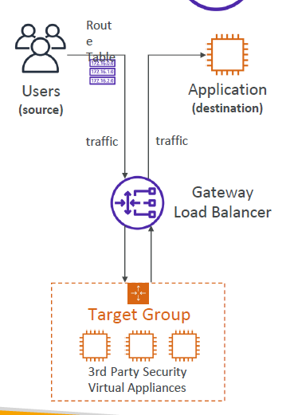

### Sticky Seccions (Afinidade de Sessão)

A ideia é que um cliente que fizer varias requests no CLB, ALB e NLB, sejam direcionado sempre para o mesmo backend. Porem pode trazer desequilíbrio para o ELB

Um Coockie é enviado como parte da request, com uma data de expiração. Quando o Cookie espirar, o cliente é direciocado para outro backend.

Usado para geralmente para não perder os dados de sessão do usuario.

**Application-Based Cookies:**
- Customizavel
    - É gerado pela nossa aplicação
    - pode incluir qualquer informação que desejar.
    - O nome do cookie deve ser especificado para cada Target Group.
    - Nomes não permitidos : AWSALB, AWSALBAPP, AWSALBTG
- Application Cookie
    - Gerado pelo LB
    - Nome será "AWSALBAPP"

**Duration-Based Cookies:**
- Gerado pelo LB
- Nome será AWSALB para ALB e AWSELB para CLB

### Cross-Zone Load Balancing

Essa funcionalidade serve para balancear a carga entre instancias que estão em AZ diferentes.
Deve ser especificado no Target Group todas as intancias para que isso funcione.

- ALB - Habilitado por padrão, Gratuito a transferencia de dados entre AZ
- NLB - Desabilitado, Se ativar, paga por transferencia de dados entre AZ
- CLB - Desabilitado, Se ativar, não paga transferencia de dados entre AZ


### SSL/TLS Certificates ELB

ELB usa um certificado X.509, e pode ser gerenciado esses certificados usando o Amazon Certificate Manager(ACM). Nele pode ser carregado seus proprios verificados.

É utilizado o SNI para especificar qual certificado deve ser utilizado quando acessar um hostname

### SNI Server Name Indication

Resolve o problema de "como cafrregar varios certificados em um Web Server que atenda varios Websites".

Este serviço requere do cliente a indicação do hostname que deseja acessar, e com base nisso, irá procurar o certificado correto para retornar ao cliente.

- Esse serviço funciona apenas para ALB e NLB e CloudFront

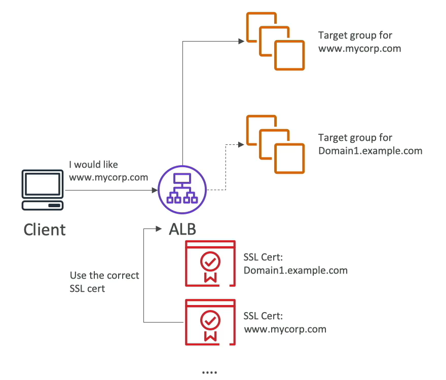


### ELB Connection Draining/Deregistration Delay (Drenagem de Conexão/Atraso no cancelamento do registro)

- Connection Draining - CLB
- Deregistration Delay - ALB, NLB

Caso exista uma instancia que esteja com problema, a função Connection Draining/De-registration Delay fará com que caso já tenha sido enviadas solicitações para essa instancia, e esteja em "in-flight", sejam processadas, para que depois a instancia seja deletada.
- pode ser definido um tempo de espera para que a "is-flight request" seja processada, entre 1 a 3600 segundos (padrão é 300)

### Auto Scaling Group

O objetivo do ASG é escalar a aplicação horizontamente, adicionando ou excluindo instancias de acorod com a nescessidade da aplicação.

- Scale Out - Add Instance
- Sclae In  - Del Instance

Caso alguma instancia tenha falha, o ASG poderá provisionar uma nova para substituir a que esta com problema

- Launch Template: É a confgiruação que a instancias terão para serem criadas caso precise
- Min/Max/Initia Size
- Scaling Policies

#### CloudWatch Alarms e Scaling

É possivel provisionar mais instancias com o ASG partindo de um gatilho do CloudWatch de acordo com a metrica que está monitorando.

### Scaling Policies

Tipos de Politixas de estaconamento:
- Escalonamento Dinamico
    - Target Tracking Scaling(escalonamento de rastreamento de metas):
        - Define uma metrica pra monitorar, e caso chegue a essa matrical ele dispara um gatinho para Scale Out ou In no ASG.
    - Simple/Step Scaling(Escalonamento por etapas)/:
        - Cria alarmes para Scale Out ou In 
- Scheduled Scaling:
    - Antecipa o escalonamento deacordo com o que voce sebe que precisa
- Predictive Scaling(Estacla preditiva):
    -  ASG analisa a carga histórica e provisionará instancias com uma previsão

Métricas boas para criar escalas:
- CPU Utilization
- Contagem Requests por Target
- Media de I/O de Network
- Métricas cuspomizadas peli CloudWatch

### Scaling Cooldowns

Assim que fizer um dimencionamento utilizando ASG, terá um tempo de "resfiamento"(default 300s) que o AS não irá dimencionar até passar esse tempo

### ASG Instance Refresh

Quando é criado um novo template de intância e desejar atualizar todas as EC2 que estão rodando.
É definido uma porcentagem de saude das instâncias, e assim que chega a essa porcentagem, uma instancia é morta, e uma nova com o novo template é iniciada.

---
<h1 align="center">RDS + Aurora + ElastiCache</h1>

### RDS - Relations Database Service

É um serviço que usa DB com liguaga SQL. Cria banco de dados que são gerenciados pela AWS.

- PostgeSQL
- MySQL
- MariaDB
- Oracle
- Microsoft SQL Server
- IBM DB2
- Aurora

Vantagens:
- Provisionamento Automático
- Backups Continuos
- Point in Time Restore
- Monitoramento
- Read Replicas
- Multi AZ
- Escalar Capacidade do Banco (Vertical e Horizontal)

### RDS Storage Auto Scaling

Esta funcionalidade faz o escalonamento automaico de mais espaço para o banco de dados, quando o seu RDS esta ficando muito cheio, fazendo com que não seja nescessario o dimencionamento manual do armazenamento.

- Deve colocar um tamanho limite para que não creça infinitamente.
- Modifica o armazenamento se:
    - Tiver menos que 10% de espaço livre
    - Mais de 5 min com o armazenamento baixo
    - 6 horas antes da ultima monificação de tamanho


### Read Replicas

- Podem ser criadas ate 15 read replicas
- Mesma AZ, AZ Cruzada, ou região cruzada
- Replica de dados asyncrono
- Pode promover uma replica para ser um Banco principal

OBS: Custor por network
- Read Replicas em diferentes AZ na mesma REGIÃO não é pago.
- Read Replicas em REGIÃO diferente é pago.

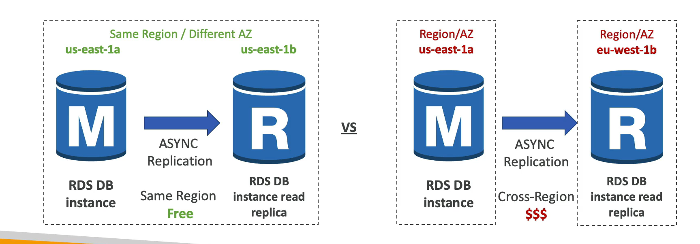

### Multi AZ 

Serviço usado geralmente para Desaster Recovery.

- Replicação de dados Sincrono
- Tem um DNS name onde caso aconteça algum problema no DB master é o DNS aponta para o outro Banco de DR.
- Aumenta a disponibilidade
- Não é usado para Escalinamento

OBS: As Read Replicas PODEM ser configuradas como multi AZ para Desaster Recover

### Amazon Aurora

Foi criado pela AWS, e é compativel com PostgreSQL e MySQL. 5x mais rapido que o MySQL e 3x mais rapido que Postgres.
- Tem crecimento de storage automatico de 10GB até 128TB
- Podem ser criadas ate 15 read replicas (lag de 10ms)
- Failover é instantaneo
- Custa mais caro de os demais RDS (20%)

#### Aurora High Availability and Read Scaling

- 6 copias dos dados em 3 AZ
- Processo de auto-correção de dados peer-to-peer nas replicações
- Tem uma instancia apenas para Escrita
- Suporta Cross Region Replication
- Tem Auto Scaling para read replicas automatico
- 

OBS: Um mestre, várias réplicas de leitura e o armazenamento será replicado, com autocorreção, expansão automática, pequenos blocos por pequenos blocos.
 
#### Aurora DB Cluster

- Witer Endpoit: é um DNS que sempre estará apontado para a instancia Mestre para Escrita

- Reader Endpoint: Faz um balanceamento de carga entre as Read Replicas pois existe AutoScaling das Replicas, assim não precisa apontar para uma Replica DB e sim para o Balanceador de Carga 

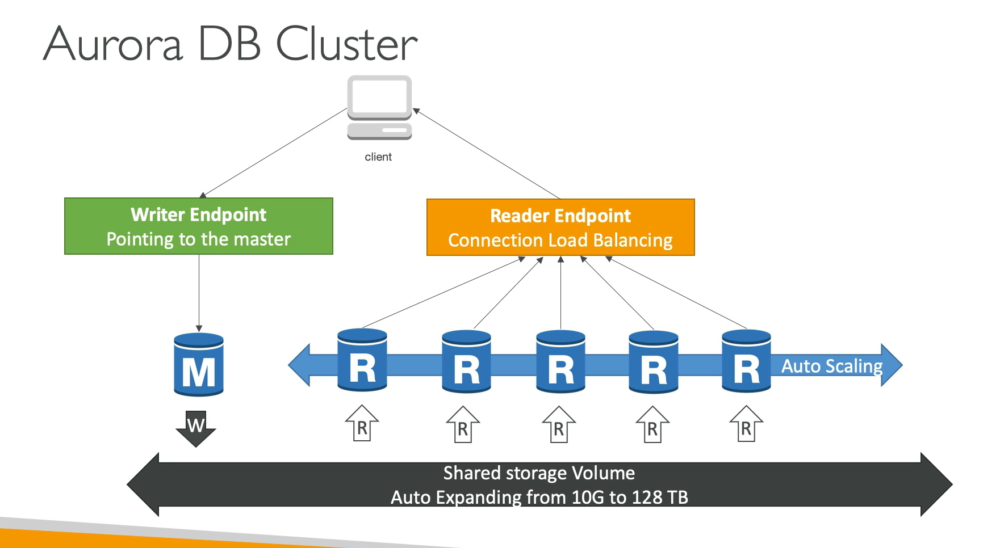


### DRS and Aurora Security

- At-rest Encryption:
    - configura a criptografia quando esta criando o DB e usa o AWS KMS.
    - se não tem configuração de criptografia, as replicas tambem não podem ser criptografadas
    - para criptografar um banco já existente, precisar criar uma snapshot, e restaurar a snapshot em um novo banco com uma configuração de criptografia.

- In-flight Encryption
- IAM Authentication: para outros recursos se conectarem ao banco de dado
- Security Groups: Controlar a rede de acesso aos banco de dados
- Não tem Conexão SSH
- Logs de Auditoria pode ser ativados e enviados para o CloudWatch

### Amazon RDS Proxy

É usado para agrupar as conexões com a instanci de Banco de Dados, Usado para minimizar o tempo de Failover em até 66%, Usado para reforçar a segurança com a IAM Authentication.

O Amazon RDS Proxy permite que os aplicativos agrupem e compartilhem conexões estabelecidas com o banco de dados, melhorando a eficiência do banco de dados e a escalabilidade dos aplicativos. 

- MySQL, POstgreSQL, MariaDB, MS SQL Server, Aurora
- Proxy não é acessivel por um IP Publico(precisa ser acessado pela VPC)

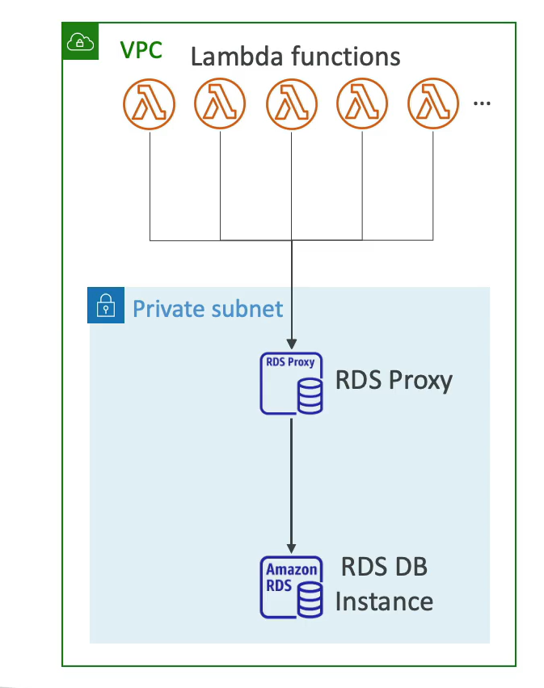

### ElastiCache

Serviço que gerencia Redis ou MemCached, onde tem High Performace e Baixa Latencia, onde o objectivo é consumilo antes de fazer uma consulta no RDS, verificando se a informação esta ainda em cache, isso serve para cargas de trabalho intensos.

Os recursos são gerenciados pela AWS (OS, Patching, optimizações, configurações, monitoramento, failure recovery e backups)

Ate 5 read replicas

- Redis: 
    - Multi-AZ
    - Read Replicas
    - Data Durability
    - Backups e Restauracão
    - Suporta conjunto e conjuntos ordenado (Sets e Sorted Sets)

- Memcached
    - Multi-Node (Sharding)
    - Não tem Read Replicas
    - Não tem dado Persistentes
    - Não tem Backups e Restauracão
    - É de Arquitetura Multi-theaded 

### ElastiCache Strategis

**Lazy Loading / Cache-Aside / Lazy Population**

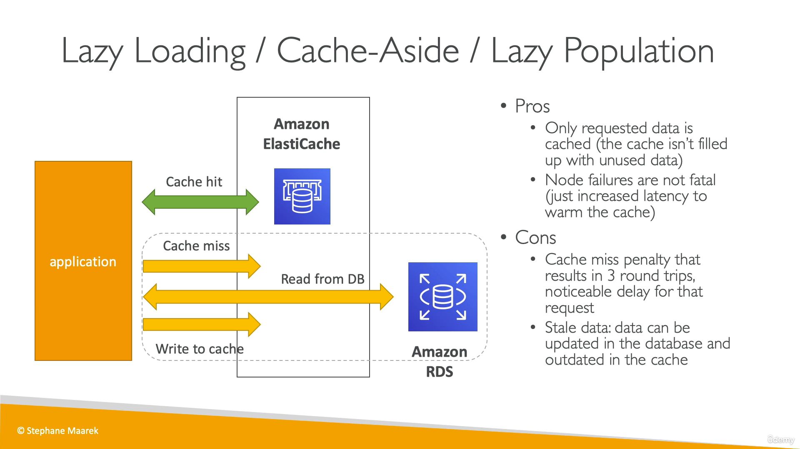

**Write Through**

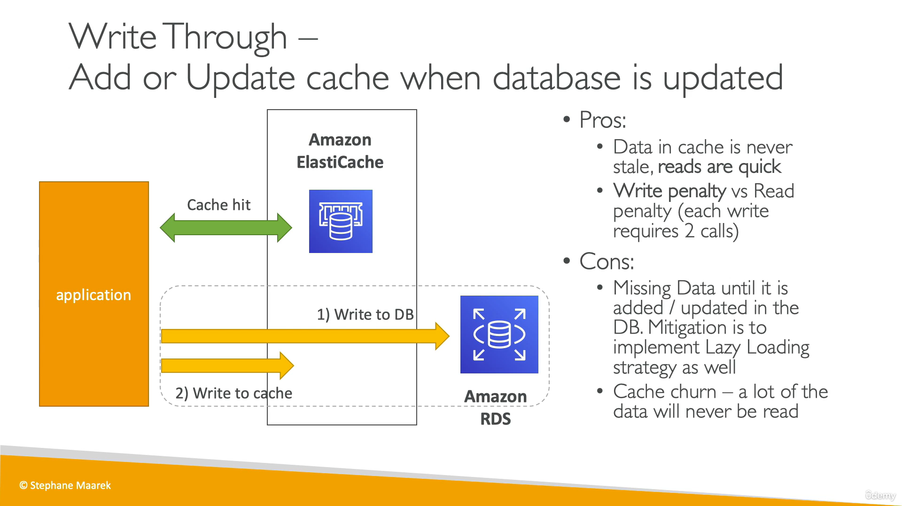

**Despejo de Cache e tempo de vida (Time-To-Live TTL)**

### Amazon MemoryDB for Redis

**Redis X MemoryDB for Redis:**
Redis é usa somente para cache, e MemoryDB for Redis é um banco de dados que tem uma API com Redis

- Ultra-fast Performace 160milões request/s
- é um dado em memoria, porem tem armazenamento de dados durável com Logs de transação Mult-AZ
- escala de 10GB ate 100TB
- usados em aplicações web, apps, jogos, app streamings

---
<h1 align="center">Route 53</h1>

## Route 53
- É um serviço de DNS onde gerencia os rotas para os Ips das aplicações. 
- Tambem é um Registrador de Dominios, onde podem ser comprado os dominios pelo Route 53.
- Pode ser feito health checks dos serviços
- Unico serviço que fornece SLA de 100%

Cada Domino deverá conter:
- Domain/SubDomain: exemplo.com
- Record Type: A or AAAA
- Value: 12.34.56.78
- Routing Policy: como o 53 respondera as chamadas
- TTL(Time-To-live) - Tempo de espera até o response


#### Record Types

- A: Mapeia IPV4
- AAAA: Mapeia PV6
- CNAME: Mapeia Hostnames
- NS: Nome de servidores para as zonas hoteadas

#### Hosted Zones

- Public Hosted Zone
- Private Hosted Zone

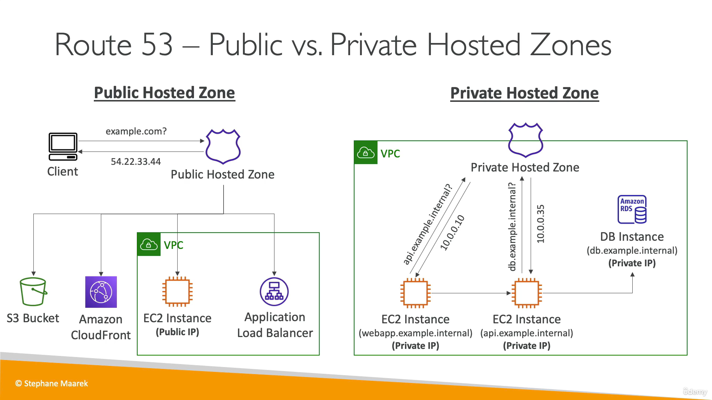


### Records TTL (Time-To-Live)

É o tempo em que o ip da aplicação ficará salvo no cache do cliente para não precisar fazer a pesquisa do IP novamente.

### CNAME vs Alias

CNAME:
- Aponta um hostname para qualquer outro hostname;
- Funciona para Dominios que não são Principal;

Alias:

OBS: Não pode setar um ALIAS para um DNS de EC2 
- Aponta um hostname apenas para recursos da AWS;
- Fuciona para Domain Principal e Não Principal;
- Tem Health Check
- Tem reconhecimento automatico de mudança de IP não precisando de configuração de TTL poir é automatico;
- São para recurços da AWS do tipo tipo A/AAAA;
- ELB, CloudFront, API Gatewa, Elastic Beanstalsk, S3 web, VPC Insterface Endpoint, Global Accelerator, Route 53 na mesma Zone.

### Routing Policies

#### Simple
- Pode ter varios IPs, e o navegador do cliente escolhe qual irá usar
- Não pode ter Heath Checks

#### Weighted (peso)
- Define o peso dos ips, e com isso quanto maior o peso, mais vezes será usado aquele IP para ser roteado
- Tem Heath Cheacks

#### Latency-Based
- Envia as requisições para o IP que tem menos latencia
- Tem Heath Cheacks

#### Failover (Active-Passive)
- A ideia é ter uma Primary Resource e um Secondary para Dasaster Recovery. O primario deve estar sendo verificado com um HC, e caso não esteja integro, o route 53 começará a mandar para o Secondary

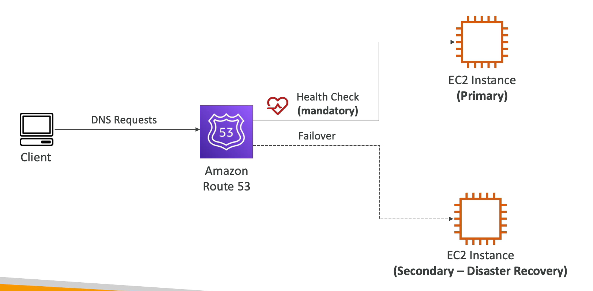

#### Geolocation
Diferente do Latency-Based, o Geolocation voce especifica qual o host que será acessado em uma região que voce escolher.

#### Geoproximity
É definio um peso para região, fazendo com que quanto maior o peso, mais usuarios serão direcionados para as rotas na região/AZ especifica.
- tem peso de 1 a 99 para direcionar MAIS trafego
- tem peso de -1 a -99 para direcionar MENOS trafego

#### Traffic Flow

É uma UI para criar e manutenir configurações conplexas de Records.
- Pode ser salvo como uma Traffic Flow Policy
- Ter versionamento

#### IP-Based Routing
Roteia paseado no IP dos clisntes que irão se conectar definindo pelos CIDR

#### Multi-Value
Usado para rotear o trafego para muitiplos recursos
- Tem Heath Cheacks
- pode ser associado até 8 health checks e retorna os ips desses health checks  
- Parece um ELB mas não é. É como se fosse um ELB no lado do cliente


### Healf Checks
- Faz Health Check em recursos Publicos
- Serve para automatizar DNS Failover
    - HC que monitora endpoint publico
    - HC que monitor HC
    - HC que monitora CloudWatch Alarm

**Monitoramento de EndPoint**
- Existem 15 Verificadores de integridade global
    - Definir limite de quantidade de saude(3 padrão)
    - intervalo de verificação 30s (10s $$)
    - HTTP, HTTPS, TCP
- só chega as requests se tiver um status 2XX ou 3XX

**Verificações de saude Calculadas**
- Combina varias verificações de HC em uma unica HC
- Usa operadores logicos para criar a logica (AND, OR, NOT)
- Pode monitorar ate 256 HC filhos

**Private Hosted Zones**
Não consegue fazer verificações em recursos privados como Private VPC ou On-Premises Privates.
Para conseguir verificar eles, será nescessario criar CW Metrics e associar a um CW Alarm, para que assim o HC verifique esses Alarms

---
<h1 align="center">VPC Virtual Private Cloud</h1>

### VPC
É uma Virtual Private Cloud que é limitado a regions.

### Subnets
São subredes dentro da VPC que permite voce a particionar a rede interna da VPC e é limitado por AZ.

#### Public Subnet
Pode ser acessada ela internet

#### Private Subnet
Nao pode ser acessada ela internet

#### Route Tables
É usada para definir o acesso de internet entre subnets

### Internet Gateway
Faz com que a VPC se conecte com a internet

### NAT Gateways
Permite que as Private Subnets tenha acesso a internet para atualizações de software

Para uma Private ter acesso a internet, deve-se ter um public subnet, onde nela, conterá a NAT Gateways que fará a ponte entre a Internet e a Private subnet.

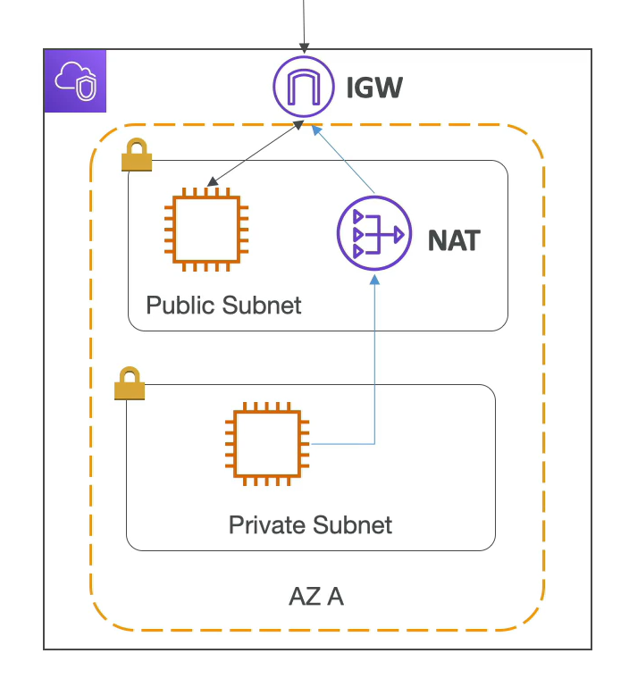

### Network ACL
É um Firewall que controla o trafego a nivel de subnet, que PERMITE ou NÃO PERMITE acessos

### Security Groups
É um Firewall que controla o trafego a nivel de Intancias ou Elastic Network Interface (ENI) que apenas PERMITE acessos

### VPC Flow Logs
Captura toda a informação de trafego de IP em toda a interface de Rede e salva os logs. Pode ser enviados para S3, CW Logs Kineses Data Firehose
- VPC Flow Logs
- Subnet Flow Logs
- Elastiv Network Interface Flow Logs

### VPC Peering
Conecta duas VPC usando a rede. se comportam como uma. O rage de Ips das duas VPC deve ser obrigatóriamente diferentes para não aver conflito de Ips

### VPC Endpoints
Permite que conecte serviços da AWS usando uma Rede Privata para conectar a outros serviços publicos como:

VPC Endpoint Gateway: S3 e DynamoDB
VPC Endpoint Interface: Resto dos serviços

### Site-to-Site VPN
Conecta uma VPN on-premises em uma VPC da AWS passando pela internet

### Direct Connect(DX)
Conecta uma VPN on-premises em uma VPC da AWS de uma forma privada não passa pela internet

### Private Link
Conexão privada entre 2 VPC de 3º, Seguro e Escalavel

### AWS Client VPN
Conecta um computador de forma privada a um VPC

### Transit Gateway 
Conexão de peering entre milhares de VPC

LEMPBRAR DA SIGLA "LAMP" Stack on EC2
- Linux: OS para EC2
- Apache: Servidor Web que roda Linux
- MySQL: Database em RDS
- PHP: Logica da Aplicação